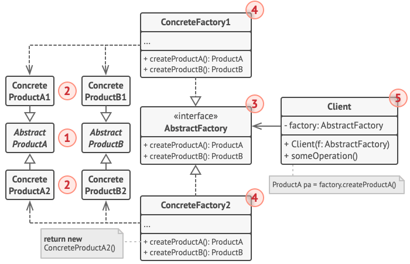

# Description
Picture this: you’re designing a creature-based card game inspired by popular monster-collecting games. Your cards are not just static objects; they are dynamic data entities that can be grouped into families, and that have capabilities used in a strategic way. But here’s the challenge: how
do you create a system flexible enough to handle thousands of different card types while maintaining clean, maintainable code?

# Abstract Programming Patterns

abstract factories, extra capabilities and strategy patterns.

## abstract factory design pattern
a creational design pattern: providing an interface to create related or dependent objects of families, no need for specific classes. Like a factory of factories: the super factory creates other factories so that produce specific objects.

*applications*: support multiple cloud platforms, support multiple database systems

### components
- __Abstract Factory__: It provides a way such that concrete factories follow a common interface, providing consistent way to produce related set of objects.
- __Concrete Factories__: Concrete Factories **implement the rules specified by the abstract factory**. It contain the logic for creating specific instances of objects within a family.
- __Abstract Products__: It acts as an abstract or interface type that all concrete products within a family must follow to and provides a unified way for concrete products to be used interchangeably.
- __Concrete Products__: They implement the methods declared in the abstract products, ensuring consistency within a family and belong to a specific category or family of related objects.
- __Client__: Client utilizes the abstract factory to create families of objects without specifying their concrete types and interacts with objects through abstract interfaces provided by abstract products.

In this project, the player's role is:
- Abstract Factory  → CreatureFactory
- Concrete Factory  → FlameFactory / AquaFactory
- Abstract Product  → Creature
- Concrete Product  → Flameling / Pyrodon / Aquabub / Torragon
- Client            → battle.py

## abstract strategy pattern
The Strategy Design Pattern is a behavioral pattern that defines a group of related algorithms, encapsulates each one in a separate class, and makes them interchangeable. It allows the algorithm to vary independently from the client that uses it, enabling behavior changes at runtime without altering existing code.

- Encapsulates different algorithms into separate strategy classes, allowing dynamic selection or switching at runtime.

- Promotes flexibility by reducing complex conditional logic and making code easier to maintain.

### components
1. Context

Acts as an intermediary between the client and the strategy, delegating tasks to the selected strategy.

- Holds a reference to a strategy object and uses it to perform operations.
- Allows switching strategies without changing its own code. 

2. Strategy Interface

Defines a common interface that all concrete strategies must implement.

- Ensures consistency so all strategies are interchangeable.
- Promotes flexibility by decoupling context from implementations. 

3. Concrete Strategies

Provide specific implementations of the strategy interface with different algorithms or behaviors.

- Encapsulate the actual logic of each algorithm.
- Can be selected and replaced based on requirements. 

4. Client

Responsible for selecting and configuring the appropriate strategy for the context.

- Decides which strategy to use based on the problem.
- Passes the chosen strategy to the context for execution.

# resources:
1. https://refactoring.guru/design-patterns/abstract-factory
2. https://www.geeksforgeeks.org/system-design/abstract-factory-pattern/
3. https://www.geeksforgeeks.org/system-design/strategy-pattern-set-1/